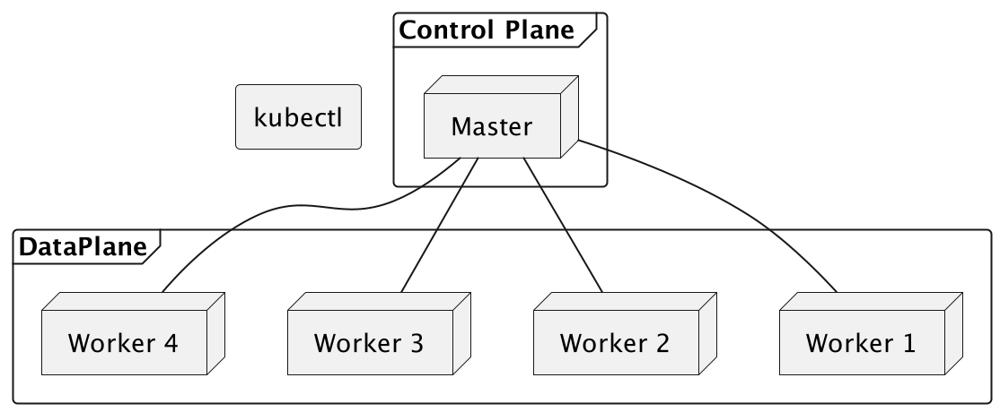

https://www.markdownguide.org/basic-syntax/

Kubernetes is Opensource
Kubernetes is cloud container platform backed by Google.
Kubernetes is used for container orchestration when large number of container are deployed on a cluster.
Kubernetes is Object based.
Smallest fundamental operating unit in the kubernetes is Pod.
Pod is group of containers(Container is an image with its runtime)
Pod is configured as Deployment resource kind in Kubernetes.
Deployment is model of the Pod, instance of Deployment is Pod actually sharing the resources of Node.
Pod is Ephemeral, can be destroyed and created again using the Deployment config.
Pod has a IP Address and port number to identify it in the Kubernetes network.
# Kubernetes Architecture


## Setup of Kubernetes
 - Prerequisite
    Docker Container or Runtime is required to run the Kubernetes Cluster.
 - Docker is a container which is used to build, run and deply the applications on to cloud/k8s cluster.
 - 
## Installation tools details
 https://kubernetes.io/docs/tasks/tools/
- Kubernetes is cluster receives commands using the kubectl tool.
- Download the kubectl binary with curl command (   curl -LO "https://dl.k8s.io/release/$(curl -L -s https://dl.k8s.io/release/stable.txt)/bin/darwin/amd64/kubectl").
- Once the binary is downloaded, validate binary can be optional step.

Make the kubectl binary executable.
~~~
chmod +x ./kubectl
sudo mv ./kubectl /usr/local/bin/kubectl
sudo chown root: /usr/local/bin/kubectl
~~~
Verify

~~~
kubectl version --client
kubectl version --client --output=yaml
~~~

## Install Minikube

minikube
Like kind, minikube is a tool that lets you run Kubernetes locally. minikube runs an all-in-one or a multi-node local Kubernetes cluster on your personal computer (including Windows, macOS and Linux PCs) so that you can try out Kubernetes, or for daily development work.

What you’ll need
2 CPUs or more
2GB of free memory
20GB of free disk space
Internet connection
Container or virtual machine manager, such as: Docker, QEMU, Hyperkit, Hyper-V, KVM, Parallels, Podman, VirtualBox, or VMware Fusion/Workstation
~~~
Srinivass-MacBook-Pro:~ srinivas$ minikube start --nodes 2 -p k8s-local-cluster
😄  [k8s-local-cluster] minikube v1.31.2 on Darwin 12.7.3
🎉  minikube 1.32.0 is available! Download it: https://github.com/kubernetes/minikube/releases/tag/v1.32.0
💡  To disable this notice, run: 'minikube config set WantUpdateNotification false'

**✨  Automatically selected the docker driver. Other choices: qemu2, ssh**
📌  Using Docker Desktop driver with root privileges
👍  Starting **control plane node** k8s-local-cluster in cluster k8s-local-cluster
🚜  Pulling base image ...
> gcr.io/k8s-minikube/kicbase...:  447.62 MiB / 447.62 MiB  100.00% 10.75 M
**🔥  Creating docker container (CPUs=2, Memory=2200MB) ...**
🐳  Preparing Kubernetes v1.27.4 on Docker 24.0.4 ...
▪ Generating certificates and keys ...
▪ Booting up control plane ...
▪ Configuring RBAC rules ...
🔗  Configuring CNI (Container Networking Interface) ...
▪ Using image gcr.io/k8s-minikube/storage-provisioner:v5
🔎  Verifying Kubernetes components...
🌟  Enabled addons: default-storageclass, storage-provisioner

👍  Starting **worker node** k8s-local-cluster-m02 in cluster k8s-local-cluster
🚜  Pulling base image ...
**🔥  Creating docker container (CPUs=2, Memory=2200MB) ...**
🌐  Found network options:
▪ NO_PROXY=192.168.49.2
🐳  Preparing Kubernetes v1.27.4 on Docker 24.0.4 ...
▪ env NO_PROXY=192.168.49.2
🔎  Verifying Kubernetes components...

❗  /usr/local/bin/kubectl is version 1.29.2, which may have incompatibilities with Kubernetes 1.27.4.
▪ Want kubectl v1.27.4? Try 'minikube kubectl -- get pods -A'
🏄  Done! kubectl is now configured to use "k8s-local-cluster" cluster and "default" namespace by default
~~~

### FAQ:
Q: From the Minikube command logs it is observed that Kubernetes is created on Docker? Is it real?

>  **Warning:** 🐳  Preparing Kubernetes v1.27.4 on Docker 24.0.4 ...   

> **Note:** Its for local environment only.   

>  **Tip:** It's worth noting that while Kubernetes can be set up on Docker for local development or testing purposes,
 in production environments, 
 it's common to use specialized Kubernetes distributions or managed Kubernetes services provided by cloud providers like 
    - Google Kubernetes Engine (GKE)
    - Amazon Elastic Kubernetes Service (EKS), or 
    - Microsoft Azure Kubernetes Service (AKS). 
 These managed services handle much of the complexity of managing a Kubernetes cluster for you.

These managed Kubernetes services abstract away the complexities of managing Kubernetes clusters, 
providing you with an easy-to-use interface to deploy and manage containerized applications. 
They handle tasks such as **provisioning**, **scaling**, **monitoring**, and **maintenance** of the Kubernetes clusters, 
allowing you to focus on developing and running your applications.


Examples of container engines include Docker Engine, Kubernetes, Amazon ECS (Elastic Container Service), Google Kubernetes Engine (GKE), and others.

~~~
$ minikube status -p k8s-local-cluster
k8s-local-cluster
type: Control Plane
host: Running
kubelet: Running
apiserver: Running
kubeconfig: Configured

k8s-local-cluster-m02
type: Worker
host: Running
kubelet: Running
~~~

## Kubectl - Kubernetes Cli client.

Syntax of command 
```jshelllanguage
kubectl [command] [TYPE] [NAME] [flags]
kubectl get pods 
kubectl config get-contexts
kubectl config set-context k8s-local-cluster
```

#### command:  
- create
- get
- describe
- delete
#### TYPE or Resource
- pod
- service
- etc

#### Name of Resource 
#### flags
- f
- o

## Adding a new Node to cluster

```console log
$ minikube node add --worker -p k8s-local-cluster
😄  Adding node m03 to cluster k8s-local-cluster
👍  Starting worker node k8s-local-cluster-m03 in cluster k8s-local-cluster
🚜  Pulling base image ...
🔥  Creating docker container (CPUs=2, Memory=2200MB) ...
🐳  Preparing Kubernetes v1.27.4 on Docker 24.0.4 ...
🔎  Verifying Kubernetes components...
🏄  Successfully added m03 to k8s-local-cluster!
```

```jshelllanguage
$ kubectl get nodes
NAME                    STATUS   ROLES           AGE     VERSION
k8s-local-cluster       Ready    control-plane   104m    v1.27.4
k8s-local-cluster-m02   Ready    <none>          101m    v1.27.4
k8s-local-cluster-m03   Ready    <none>          3m51s   v1.27.4
```

## Dashboard K8s

Its amazing to see this dashboard in my machine I wandered to see it!!


```jshelllanguage
$ minikube dashboard --url -p k8s-local-cluster
🔌  Enabling dashboard ...
    ▪ Using image docker.io/kubernetesui/dashboard:v2.7.0
    ▪ Using image docker.io/kubernetesui/metrics-scraper:v1.0.8
💡  Some dashboard features require the metrics-server addon. To enable all features please run:

	minikube -p k8s-local-cluster addons enable metrics-server	


🤔  Verifying dashboard health ...
🚀  Launching proxy ...
🤔  Verifying proxy health ...
http://127.0.0.1:58416/api/v1/namespaces/kubernetes-dashboard/services/http:kubernetes-dashboard:/proxy/
```

# POD
What is a POD?
POD is shell/case around the group of things. like Pea seeds.
Pod is an encapsulated layer for of group or single container/s.
Smallest deployable units of computation in the Kubernetes cluster. Runs on Worker nodes.
Created and Managed by the kubelet.
Pod is identified with dedicated IP Address and a port number on its network.

Pods are the smallest deployable units of computing that you can create and manage in Kubernetes.

A Pod (as in a pod of whales or pea pod) is a group of one or more containers, 
with shared storage and network resources,
and a specification for how to run the containers.

Additional details:
As well as application containers, a Pod can contain init containers that run during Pod startup.  
You can also inject ephemeral containers for debugging a running Pod.

Use cases:
 - One Container per Pod.
 - Multiple Container per Pod.