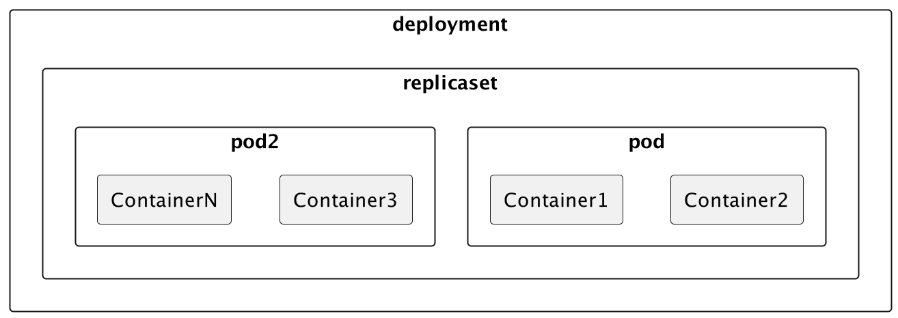

https://www.markdownguide.org/basic-syntax/

Kubernetes is Opensource
Kubernetes is cloud container platform backed by Google.
Kubernetes is used for container orchestration when large number of container are deployed on a cluster.
Kubernetes is Object based.
Smallest fundamental operating unit in the kubernetes is Pod.
Pod is group of containers(Container is an image with its runtime)
Pod is configured as Deployment resource kind in Kubernetes.
Deployment is model of the Pod, instance of Deployment is Pod actually sharing the resources of Node.
Pod is Ephemeral, can be destroyed and created again using the Deployment config.
Pod has a IP Address and port number to identify it in the Kubernetes network.
# Kubernetes Architecture


## Setup of Kubernetes
 - Prerequisite
    Docker Container or Runtime is required to run the Kubernetes Cluster.
 - Docker is a container which is used to build, run and deply the applications on to cloud/k8s cluster.
 - 
## Installation tools details
 https://kubernetes.io/docs/tasks/tools/
- Kubernetes is cluster receives commands using the kubectl tool.
- Download the kubectl binary with curl command (   curl -LO "https://dl.k8s.io/release/$(curl -L -s https://dl.k8s.io/release/stable.txt)/bin/darwin/amd64/kubectl").
- Once the binary is downloaded, validate binary can be optional step.

Make the kubectl binary executable.
~~~
chmod +x ./kubectl
sudo mv ./kubectl /usr/local/bin/kubectl
sudo chown root: /usr/local/bin/kubectl
~~~
Verify

~~~
kubectl version --client
kubectl version --client --output=yaml
~~~

## Install Minikube

minikube
Like kind, minikube is a tool that lets you run Kubernetes locally. minikube runs an all-in-one or a multi-node local Kubernetes cluster on your personal computer (including Windows, macOS and Linux PCs) so that you can try out Kubernetes, or for daily development work.

What you’ll need
2 CPUs or more
2GB of free memory
20GB of free disk space
Internet connection
Container or virtual machine manager, such as: Docker, QEMU, Hyperkit, Hyper-V, KVM, Parallels, Podman, VirtualBox, or VMware Fusion/Workstation
~~~
Srinivass-MacBook-Pro:~ srinivas$ minikube start --nodes 2 -p k8s-local-cluster
😄  [k8s-local-cluster] minikube v1.31.2 on Darwin 12.7.3
🎉  minikube 1.32.0 is available! Download it: https://github.com/kubernetes/minikube/releases/tag/v1.32.0
💡  To disable this notice, run: 'minikube config set WantUpdateNotification false'

**✨  Automatically selected the docker driver. Other choices: qemu2, ssh**
📌  Using Docker Desktop driver with root privileges
👍  Starting **control plane node** k8s-local-cluster in cluster k8s-local-cluster
🚜  Pulling base image ...
> gcr.io/k8s-minikube/kicbase...:  447.62 MiB / 447.62 MiB  100.00% 10.75 M
**🔥  Creating docker container (CPUs=2, Memory=2200MB) ...**
🐳  Preparing Kubernetes v1.27.4 on Docker 24.0.4 ...
▪ Generating certificates and keys ...
▪ Booting up control plane ...
▪ Configuring RBAC rules ...
🔗  Configuring CNI (Container Networking Interface) ...
▪ Using image gcr.io/k8s-minikube/storage-provisioner:v5
🔎  Verifying Kubernetes components...
🌟  Enabled addons: default-storageclass, storage-provisioner

👍  Starting **worker node** k8s-local-cluster-m02 in cluster k8s-local-cluster
🚜  Pulling base image ...
**🔥  Creating docker container (CPUs=2, Memory=2200MB) ...**
🌐  Found network options:
▪ NO_PROXY=192.168.49.2
🐳  Preparing Kubernetes v1.27.4 on Docker 24.0.4 ...
▪ env NO_PROXY=192.168.49.2
🔎  Verifying Kubernetes components...

❗  /usr/local/bin/kubectl is version 1.29.2, which may have incompatibilities with Kubernetes 1.27.4.
▪ Want kubectl v1.27.4? Try 'minikube kubectl -- get pods -A'
🏄  Done! kubectl is now configured to use "k8s-local-cluster" cluster and "default" namespace by default
~~~

### FAQ:
Q: From the Minikube command logs it is observed that Kubernetes is created on Docker? Is it real?

>  **Warning:** 🐳  Preparing Kubernetes v1.27.4 on Docker 24.0.4 ...   

> **Note:** Its for local environment only.   

>  **Tip:** It's worth noting that while Kubernetes can be set up on Docker for local development or testing purposes,
 in production environments, 
 it's common to use specialized Kubernetes distributions or managed Kubernetes services provided by cloud providers like 
    - Google Kubernetes Engine (GKE)
    - Amazon Elastic Kubernetes Service (EKS), or 
    - Microsoft Azure Kubernetes Service (AKS). 
 These managed services handle much of the complexity of managing a Kubernetes cluster for you.

These managed Kubernetes services abstract away the complexities of managing Kubernetes clusters, 
providing you with an easy-to-use interface to deploy and manage containerized applications. 
They handle tasks such as **provisioning**, **scaling**, **monitoring**, and **maintenance** of the Kubernetes clusters, 
allowing you to focus on developing and running your applications.


Examples of container engines include Docker Engine, Kubernetes, Amazon ECS (Elastic Container Service), Google Kubernetes Engine (GKE), and others.

~~~
$ minikube status -p k8s-local-cluster
k8s-local-cluster
type: Control Plane
host: Running
kubelet: Running
apiserver: Running
kubeconfig: Configured

k8s-local-cluster-m02
type: Worker
host: Running
kubelet: Running
~~~

## Kubectl - Kubernetes Cli client.

Syntax of command 
```jshelllanguage
kubectl [command] [TYPE] [NAME] [flags]
kubectl get pods 
kubectl config get-contexts
kubectl config set-context k8s-local-cluster
```

#### command:  
- create
- get
- describe
- delete
#### TYPE or Resource
- pod
- service
- etc

#### Name of Resource 
#### flags
- f
- o

## Adding a new Node to cluster

```console log
$ minikube node add --worker -p k8s-local-cluster
😄  Adding node m03 to cluster k8s-local-cluster
👍  Starting worker node k8s-local-cluster-m03 in cluster k8s-local-cluster
🚜  Pulling base image ...
🔥  Creating docker container (CPUs=2, Memory=2200MB) ...
🐳  Preparing Kubernetes v1.27.4 on Docker 24.0.4 ...
🔎  Verifying Kubernetes components...
🏄  Successfully added m03 to k8s-local-cluster!
```

```jshelllanguage
$ kubectl get nodes
NAME                    STATUS   ROLES           AGE     VERSION
k8s-local-cluster       Ready    control-plane   104m    v1.27.4
k8s-local-cluster-m02   Ready    <none>          101m    v1.27.4
k8s-local-cluster-m03   Ready    <none>          3m51s   v1.27.4
```

## Dashboard K8s

Its amazing to see this dashboard in my machine I wandered to see it!!


```jshelllanguage
$ minikube dashboard --url -p k8s-local-cluster
🔌  Enabling dashboard ...
    ▪ Using image docker.io/kubernetesui/dashboard:v2.7.0
    ▪ Using image docker.io/kubernetesui/metrics-scraper:v1.0.8
💡  Some dashboard features require the metrics-server addon. To enable all features please run:

	minikube -p k8s-local-cluster addons enable metrics-server	


🤔  Verifying dashboard health ...
🚀  Launching proxy ...
🤔  Verifying proxy health ...
http://127.0.0.1:58416/api/v1/namespaces/kubernetes-dashboard/services/http:kubernetes-dashboard:/proxy/
```
### Delete a Node from Cluster using Minikube command

```
$ minikube node delete k8s-local-cluster-m03 -p k8s-local-cluster

🔥  Deleting node k8s-local-cluster-m03 from cluster k8s-local-cluster
✋  Stopping node "k8s-local-cluster-m03"  ...
🛑  Powering off "k8s-local-cluster-m03" via SSH ...
🔥  Deleting "k8s-local-cluster-m03" in docker ...

```
# POD
What is a POD?
POD is shell/case around the group of things. like Pea seeds.
Pod is an encapsulated layer for of group or single container/s.
Smallest deployable units of computation in the Kubernetes cluster. Runs on Worker nodes.
Created and Managed by the kubelet.
Pod is identified with dedicated unique IP Address and range of ports on its network.
With in the POD containers shares same network and communicate with localhost.
Containers belonging to different PODs use the IP Address to communicate with.

Pods are the smallest deployable units of computing that you can create and manage in Kubernetes.

A Pod (as in a pod of whales or pea pod) is a group of one or more containers, 
with shared storage and network resources,
and a specification for how to run the containers.

Additional details:
As well as application containers, a Pod can contain init containers that run during Pod startup.  
You can also inject ephemeral containers for debugging a running Pod.

Use cases:
 - One Container per Pod.
 - Multiple Container per Pod.

Multi Container POD
Helper Container
Main Container

### Sidecar Containers
Sidecar containers are the secondary containers that run along with the main application container within the same Pod. 
These containers are used to enhance or to extend the functionality of the main application container by providing additional services, 
or functionality such as logging, monitoring, security, or data synchronization, without directly altering the primary application code.

### Create a POD
 Use kubectl run command
 
```jshelllanguage
$ kubectl run nginx-pod --image=ngnix
pod/nginx-pod created

$ kubectl get pods
NAME        READY   STATUS             RESTARTS   AGE
nginx-pod   0/1     ImagePullBackOff   0          56s

$kubectl 
```
##### All the resources and their kind, api version ansd short name details.
> [Note]- Click Here 
```jshelllanguage
$ kubectl api-resources
NAME                              SHORTNAMES   APIVERSION                             NAMESPACED   KIND
bindings                                       v1                                     true         Binding
componentstatuses                 cs           v1                                     false        ComponentStatus
configmaps                        cm           v1                                     true         ConfigMap
endpoints                         ep           v1                                     true         Endpoints
events                            ev           v1                                     true         Event
limitranges                       limits       v1                                     true         LimitRange
namespaces                        ns           v1                                     false        Namespace
nodes                             no           v1                                     false        Node
persistentvolumeclaims            pvc          v1                                     true         PersistentVolumeClaim
persistentvolumes                 pv           v1                                     false        PersistentVolume
pods                              po           v1                                     true         Pod
podtemplates                                   v1                                     true         PodTemplate
replicationcontrollers            rc           v1                                     true         ReplicationController
resourcequotas                    quota        v1                                     true         ResourceQuota
secrets                                        v1                                     true         Secret
serviceaccounts                   sa           v1                                     true         ServiceAccount
services                          svc          v1                                     true         Service
mutatingwebhookconfigurations                  admissionregistration.k8s.io/v1        false        MutatingWebhookConfiguration
validatingwebhookconfigurations                admissionregistration.k8s.io/v1        false        ValidatingWebhookConfiguration
customresourcedefinitions         crd,crds     apiextensions.k8s.io/v1                false        CustomResourceDefinition
apiservices                                    apiregistration.k8s.io/v1              false        APIService
controllerrevisions                            apps/v1                                true         ControllerRevision
daemonsets                        ds           apps/v1                                true         DaemonSet
deployments                       deploy       apps/v1                                true         Deployment
replicasets                       rs           apps/v1                                true         ReplicaSet
statefulsets                      sts          apps/v1                                true         StatefulSet
tokenreviews                                   authentication.k8s.io/v1               false        TokenReview
localsubjectaccessreviews                      authorization.k8s.io/v1                true         LocalSubjectAccessReview
selfsubjectaccessreviews                       authorization.k8s.io/v1                false        SelfSubjectAccessReview
selfsubjectrulesreviews                        authorization.k8s.io/v1                false        SelfSubjectRulesReview
subjectaccessreviews                           authorization.k8s.io/v1                false        SubjectAccessReview
horizontalpodautoscalers          hpa          autoscaling/v2                         true         HorizontalPodAutoscaler
cronjobs                          cj           batch/v1                               true         CronJob
jobs                                           batch/v1                               true         Job
certificatesigningrequests        csr          certificates.k8s.io/v1                 false        CertificateSigningRequest
leases                                         coordination.k8s.io/v1                 true         Lease
endpointslices                                 discovery.k8s.io/v1                    true         EndpointSlice
events                            ev           events.k8s.io/v1                       true         Event
flowschemas                                    flowcontrol.apiserver.k8s.io/v1beta3   false        FlowSchema
prioritylevelconfigurations                    flowcontrol.apiserver.k8s.io/v1beta3   false        PriorityLevelConfiguration
ingressclasses                                 networking.k8s.io/v1                   false        IngressClass
ingresses                         ing          networking.k8s.io/v1                   true         Ingress
networkpolicies                   netpol       networking.k8s.io/v1                   true         NetworkPolicy
runtimeclasses                                 node.k8s.io/v1                         false        RuntimeClass
poddisruptionbudgets              pdb          policy/v1                              true         PodDisruptionBudget
clusterrolebindings                            rbac.authorization.k8s.io/v1           false        ClusterRoleBinding
clusterroles                                   rbac.authorization.k8s.io/v1           false        ClusterRole
rolebindings                                   rbac.authorization.k8s.io/v1           true         RoleBinding
roles                                          rbac.authorization.k8s.io/v1           true         Role
priorityclasses                   pc           scheduling.k8s.io/v1                   false        PriorityClass
csidrivers                                     storage.k8s.io/v1                      false        CSIDriver
csinodes                                       storage.k8s.io/v1                      false        CSINode
csistoragecapacities                           storage.k8s.io/v1                      true         CSIStorageCapacity
storageclasses                    sc           storage.k8s.io/v1                      false        StorageClass
volumeattachments                              storage.k8s.io/v1                      false        VolumeAttachment
```

#### Create POD using yaml file config
Create a Pod and get pod filter by labels.

```jshelllanguage
$ kubectl apply -f nginx-pod.yaml

$ kubectl get pods -l env=dev
NAME          READY   STATUS    RESTARTS   AGE
nginx-pod-1   1/1     Running   0          6m44s
```
NAME - Name of the POD
READY 1/1 mean 1 container is running out of 1 defined.
RESTARTS - As of now pod is not restarted at least once so 0.
AGE - Aging of pod.
IP - Network IP Address of the Pod. 
Node - Worker node in which it is running.

##### Details of the POD
```jshelllanguage
$ kubectl get pod nginx-pod-1 -o wide
NAME          READY   STATUS    RESTARTS   AGE   IP           NODE                    NOMINATED NODE   READINESS GATES
nginx-pod-1   1/1     Running   0          10m   10.244.2.4   k8s-local-cluster-m03   <none>           <none>

$ kubectl get pod nginx-pod-1 -o yaml
$ kubectl describe pod nginx-pod-1
```
-o Flag indicates the format in wide or yaml (yml does not work - tested)

# Pod & Container Bash in Interactive Mode 
Enter into bash shell of the Pod using the below command.
```jshelllanguage
$ kubectl exec -it nginx-pod-1 -- bash
$kubectl exec -it nginx-pod-1 -c nginx-deployment -- bash
```

# Access POD 
How to access POD.
We can not directly access POD from outside of the node other wise from the host/cluster that it is running by doing port forwarding.

## Port forwarding
Post forwarding using kubectl.

```jshelllanguage
$ kubectl port-forward nginx-pod-1 8083:80
Forwarding from 127.0.0.1:8083 -> 80
Forwarding from [::1]:8083 -> 80
Handling connection for 8083
Handling connection for 8083

$kubectl logs nginx-pod-1
```

## Replicaset Intro [High Availability]

- **High Availability**: Application should  be available to client all the times, should be fault tolerant, 
in case of any POD/Node/Container/Cluster crashes k8s handles ir through replicas.

- **Self Healing**:
Bring up the PODs automatically. DESIRED state and CURRENT no of POD running should match. 
If a pod is corrupted and killed due to any reasons it should be recreated automatically.

- **_Rollout and Rollback:_**

Create ReplicaSet using yaml file configuration

```jshelllanguage
$ kubectl apply -f nginx-replicas.yaml
replicaset.apps/nginx-replica-set created

$ kubectl get pods
NAME                      READY   STATUS              RESTARTS   AGE
nginx-replica-set-cvhht   0/1     ContainerCreating   0          10s
nginx-replica-set-pskwg   1/1     Running             0          10s
nginx-replica-set-pvvwc   0/1     ContainerCreating   0          10s

$ kubectl get rs
NAME                DESIRED   CURRENT   READY   AGE
nginx-replica-set   3         3         3       71s

$ kubectl get pods
NAME                      READY   STATUS    RESTARTS   AGE
nginx-replica-set-cvhht   1/1     Running   0          77s
nginx-replica-set-pskwg   1/1     Running   0          77s
nginx-replica-set-pvvwc   1/1     Running   0          77s

```

### Synthesis of Self healing steps:
Simulate the Self healing Scenario Step by step with different use cases
#### Delete a Node 
- Before deleting a node add extra node as we have only one worker node now
- ```$ minikube node add --worker -p k8s-local-cluster```
- ```$ minikube node delete k8s-local-cluster-m03 -p k8s-local-cluster```
- ```kubectl get nodes```
- ```kubectl get po -o wide```
- 
 #### Delete a Pod

### Delete All Pods

```jshelllanguage
$ kubectl delete pods --all -A
pod "nginx-replica-set-pvvwc" deleted
pod "nginx-replica-set-sgtbv" deleted
pod "nginx-replica-set-w9tvz" deleted
pod "coredns-5d78c9869d-2bqjk" deleted
pod "etcd-k8s-local-cluster" deleted
pod "kindnet-d8272" deleted
pod "kindnet-jsv6c" deleted
pod "kube-apiserver-k8s-local-cluster" deleted
pod "kube-controller-manager-k8s-local-cluster" deleted
pod "kube-proxy-pcfk6" deleted
pod "kube-proxy-qpt4r" deleted
pod "kube-scheduler-k8s-local-cluster" deleted
pod "storage-provisioner" deleted
pod "dashboard-metrics-scraper-5dd9cbfd69-98b2g" deleted
pod "kubernetes-dashboard-5c5cfc8747-rhvrb" deleted
```

Error Scenario:

```plantuml
$ kubectl apply -f nginx-deployment.yaml 
The Deployment "nginx-deployment" is invalid: 
* spec.template.metadata.labels: Invalid value: map[string]string{"env":"dev", "team":"backend", "version":"test"}: `selector` does not match template `labels`
* spec.selector: Invalid value: v1.LabelSelector{MatchLabels:map[string]string{"env":"dev3", "team":"backend3"}, MatchExpressions:[]v1.LabelSelectorRequirement(nil)}: field is immutable
```


## Deployment  -- Desired State
A Deployment provides declarative updates for Pods and ReplicaSets.

You describe a desired state in a Deployment, and the Deployment Controller changes the actual state to the desired state at a controlled rate. 
You can define Deployments to create new ReplicaSets, or to remove existing Deployments and adopt all their resources with new Deployments.

### Deployment Resource creation
This is used to get extra benefits like rollout and rollback

```
Srinivass-MacBook-Pro:deployments $ kubectl apply -f nginx-deployment.yaml 
deployment.apps/nginx-deployment created
Srinivass-MacBook-Pro:deployments $ kubectl get nodes
NAME                    STATUS   ROLES           AGE   VERSION
k8s-local-cluster       Ready    control-plane   9h    v1.27.4
k8s-local-cluster-m02   Ready    <none>          58m   v1.27.4
Srinivass-MacBook-Pro:deployments $ kubectl get pods
NAME                                READY   STATUS    RESTARTS   AGE
nginx-deployment-844c4b59f9-5xh2h   1/1     Running   0          14s
nginx-deployment-844c4b59f9-ltkpg   1/1     Running   0          14s
nginx-deployment-844c4b59f9-n9xf7   1/1     Running   0          14s
Srinivass-MacBook-Pro:deployments $ kubectl get rs
NAME                          DESIRED   CURRENT   READY   AGE
nginx-deployment-844c4b59f9   3         3         3       21s
```



## scale 
```plantuml
$ kubectl scale --replicas=4 deployment/nginx-deployment
```
### Rollout
Whenever there is change in the template section of Deployment configuration a new rollout is initiated by Kubernetes.
This action ensures no impact on existing resources running inside and on client requests to them.
K8s maintains last 10/configured value number of backups of replicas maintained and not deleted to rollback if needed.
A new ReplicaSet is created along old ReplicaSet once all the 

#### History of the rollouts 
```plantuml
$ kubectl rollout history deployment/nginx-deployment
deployment.apps/nginx-deployment 
REVISION  CHANGE-CAUSE
1         <none>
2         kubectl apply --filename=nginx-deployment.yaml --record=true
```
 
### Rollback
Rollout to previous version or a specific revision in the history if it is available.
```plantuml
$ kubectl rollout undo deployment/nginx-deployment
deployment.apps/nginx-deployment rolled back

$ kubectl rollout undo deployment/nginx-deployment
deployment.apps/nginx-deployment rolled back

$ kubectl rollout undo deployment/nginx-deployment --to-revision=2
deployment.apps/nginx-deployment rolled back

$ kubectl rollout undo deployment/nginx-deployment --to-revision=3
error: unable to find specified revision 3 in history

```


# Service SVC
In Kubernetes, a Service is a method for exposing a network application that is running as one or more Pods in your cluster.
The Service API, part of Kubernetes, is an abstraction to help you expose groups of Pods over a network. 
Each Service object defines a logical set of endpoints (usually these endpoints are Pods) along with a policy about how to make those pods accessible.


The Service abstraction enables this decoupling.

```plantuml

```
```plantuml
$ kubectl apply -f nginx-service.yaml 
service/nginx-service created
$ kubectl get svc
NAME            TYPE        CLUSTER-IP     EXTERNAL-IP   PORT(S)    AGE
kubernetes      ClusterIP   10.96.0.1      <none>        443/TCP    11m
nginx-service   ClusterIP   10.97.201.72   <none>        8082/TCP   12s
```

### Endpoint is not created when there is no match of labels of Pod and Service.
With in POD unable to get ping with service IP.
```
$ kubectl get endpoints -A
NAMESPACE              NAME                        ENDPOINTS                                     AGE
default                kubernetes                  192.168.49.2:8443                             8m36s
default                nginx-service               <none>                                        7m10s
kube-system            k8s.io-minikube-hostpath    <none>                                        11h
kube-system            kube-dns                    10.244.4.4:53,10.244.4.4:53,10.244.4.4:9153   11h
kubernetes-dashboard   dashboard-metrics-scraper   10.244.4.5:8000                               9h
kubernetes-dashboard   kubernetes-dashboard        10.244.4.6:9090                               9h
```


```
$ kubectl get endpoints -A
NAMESPACE              NAME                        ENDPOINTS                                     AGE
default                kubernetes                  192.168.49.2:8443                             91s
default                nginx-service               10.244.0.30:80,10.244.4.30:80                 64s
kube-system            k8s.io-minikube-hostpath    <none>                                        11h
kube-system            kube-dns                    10.244.4.4:53,10.244.4.4:53,10.244.4.4:9153   11h
kubernetes-dashboard   dashboard-metrics-scraper   10.244.4.5:8000                               9h
kubernetes-dashboard   kubernetes-dashboard        10.244.4.6:9090                               9h
Srinivass-MacBook-Pro:deployments srinivasminigula$
```

#### Successfully got ping with IP and Port number with in the POD

```plantuml
$ kubectl exec -it nginx-deployment-844c4b59f9-hxxj4 -- sh
# curl 10.110.86.202:8082
<!DOCTYPE html>
<html>
<head>
<title>Welcome to nginx!</title>
<style>
html { color-scheme: light dark; }
body { width: 35em; margin: 0 auto;
font-family: Tahoma, Verdana, Arial, sans-serif; }
</style>
</head>
<body>
<h1>Welcome to nginx!</h1>
<p>If you see this page, the nginx web server is successfully installed and
working. Further configuration is required.</p>

<p>For online documentation and support please refer to
<a href="http://nginx.org/">nginx.org</a>.<br/>
Commercial support is available at
<a href="http://nginx.com/">nginx.com</a>.</p>

<p><em>Thank you for using nginx.</em></p>
</body>
</html>
# 

```
# Ingress
Ingress can provide load balancing, SSL termination, and name-based virtual hosting.

